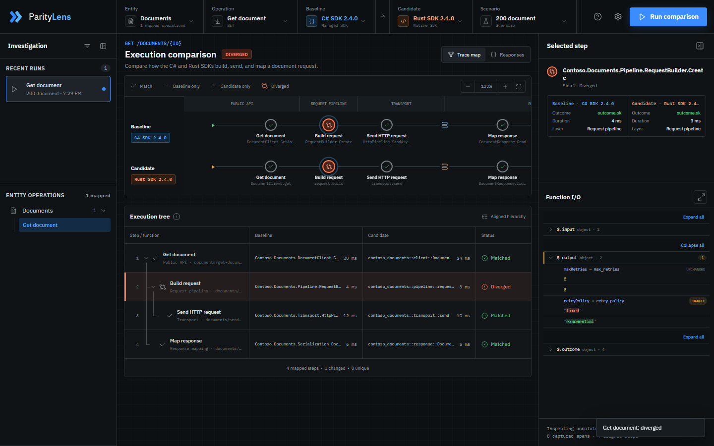

# Parity Lens

Parity Lens compares the observable behavior of two SDK implementations. It runs equivalent public operations, captures annotated function boundaries, normalizes runtime-specific fields and outcomes, and presents the first meaningful divergence in a browser workspace.



_A traced C#-to-Rust SDK comparison with the first behavioral divergence selected._

The open-source repository is SDK-neutral. It contains:

- the ASP.NET Core comparison host and Data Studio;
- the `ParityLens.TraceInstrumentation` package for attribute-driven C# IL weaving;
- the `parity_lens_trace` and `parity_lens_trace_macros` Rust crates;
- a versioned parity-data schema and neutral sample catalog;
- tests for normalization, comparison, and tracing infrastructure.

SDK source, fixtures, credentials, and integration adapters do not belong in the repository. Local registrations live in the gitignored `Data/` directory.

## Prerequisites

- the .NET SDK selected by `global.json`;
- the Rust toolchain selected by `rust-toolchain.toml`;
- Node.js when running browser-unit or Playwright tests.

## Run the neutral host

```powershell
dotnet build ParityLens.slnx
dotnet run --project src/ParityLens.Web --urls http://127.0.0.1:5187
```

Open `http://127.0.0.1:5187`. This quick start loads [`samples/parity-data.v1.json`](samples/parity-data.v1.json) so the catalog and Data Studio remain available without SDK source. It does not execute SDK comparisons. Registered SDKs use the integration build and launch sequence in [docs/integrations.md](docs/integrations.md#build-and-run-registered-sdks).

Run the repository checks with:

```powershell
pwsh -NoProfile -File eng/test.ps1
```

## Register SDKs

Create this local layout:

```text
Data/
  parity-data.v1.json
  ParityLens.Integration.dll
  parity-data.versions/
  Integration/
    ParityLens.Integration.csproj
submodules/
  <csharp-sdk>/
  <rust-sdk>/
```

`Data/parity-data.v1.json` declares runtime versions, operations, fixtures, paired functions, fields, outcomes, errors, enums, and software layers. `ParityLens.Integration.dll` contains one public, parameterless implementation of `IParityRunner`. The host loads it at startup. Override the path with `ParityLens:IntegrationAssembly` in configuration when needed.

A running host needs one runner, not one runner for every possible pairing. The runner registers each available SDK version and resolves the selected baseline and candidate independently. The same runner can therefore execute C# against Rust, C# against C#, Rust against Rust, or any additional registered versions. Adding a source checkout alone does not register it: wire the SDK into the integration build, add its version key to the runner and catalog, and map its trace symbols.

Submodules are required only when the integration builds SDKs from local source. Package releases and externally supplied build artifacts may be registered instead. Parity Lens does not ship SDK submodules; local-source integrations register each additional SDK version as a local-only submodule, add it to the ignored local solution or Cargo workspace, and rebuild before that version can be selected as a baseline or candidate.

See [docs/integrations.md](docs/integrations.md) for the complete local-only submodule registration, adapter registry, build, run, C# weaving, Rust annotation, fixture, and validation workflow.

## Data contract

The catalog is the stable identity layer between runtimes. Runtime names remain exact in endpoint registrations, while shared IDs drive comparison.

Each operation supplies:

- typed invocation inputs and editable parameter metadata;
- assertions for the request produced by each SDK;
- exact in-memory response bytes;
- one root function and any internal trace boundaries;
- field, enum, outcome, and error mappings.

The integration must invoke real public SDK APIs and replace only the final network sender. Request construction, routing, resilience, execution, and response parsing stay active. This makes differences attributable to production behavior rather than mocks.

Scenarios may replace the final response while preserving the operation's invocation and request assertion. `bodyText` is the exact UTF-8 payload, which permits JSON, HTML, malformed content, and empty bodies to reach both runtimes unchanged.

## Trace instrumentation

C# integrations annotate concrete methods with `[ParityTraceFunction]` and structural boundary types with `[ParityTraceData]`. `MethodBoundaryAspect.Fody` injects entry, completion, and exception hooks after compilation. The integration opens an ambient `ParityTraceSession`; SDK code does not own collectors, sinks, or context hooks.

Rust integrations use `#[trace_function]`, `#[trace_data]`, and `#[trace_enum]` from `parity_lens_trace`, then execute the public operation inside a task-local `capture` scope. Function bodies contain no manual tracing calls.

Both runtimes emit exact implementation symbols, selected inputs, structural output, duration, success, span ID, parent span ID, depth, and sequence. Corresponding boundaries share stable step IDs even when parameter names and type names differ.

## Browser assets

Browser dependencies and IBM Plex fonts are pinned in [`package.json`](package.json) and served from `wwwroot/vendor`. The UI makes no third-party CDN requests at runtime.

## Licenses

Parity Lens is dual-licensed under the [MIT License](LICENSE-MIT) and [Apache License 2.0](LICENSE-APACHE).
